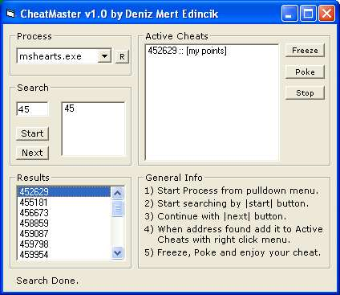



## CheatMaster

### Description

A pure VB program to cheat in games, like "WinHack" and "Game Wizard". It is well commented and uses WriteProcessMemory and ReadProcessMemory functions.

Please write your comments for further development.
 
### More Info
 

             |
---                |---
**Submitted On**   |2002-03-01 22:36:58
**By**             |[Deniz Mert Edincik](https://github.com/Planet-Source-Code/PSCIndex/blob/master/ByAuthor/deniz-mert-edincik.md)
**Level**          |Advanced
**User Rating**    |4.4 (88 globes from 20 users)
**Compatibility**  |VB 6\.0
**Category**       |[Complete Applications](https://github.com/Planet-Source-Code/PSCIndex/blob/master/ByCategory/complete-applications__1-27.md)
**World**          |[Visual Basic](https://github.com/Planet-Source-Code/PSCIndex/blob/master/ByWorld/visual-basic.md)
**Archive File**   |[CheatMaste58645312002\.zip](https://github.com/Planet-Source-Code/deniz-mert-edincik-cheatmaster__1-32235/archive/master.zip)

